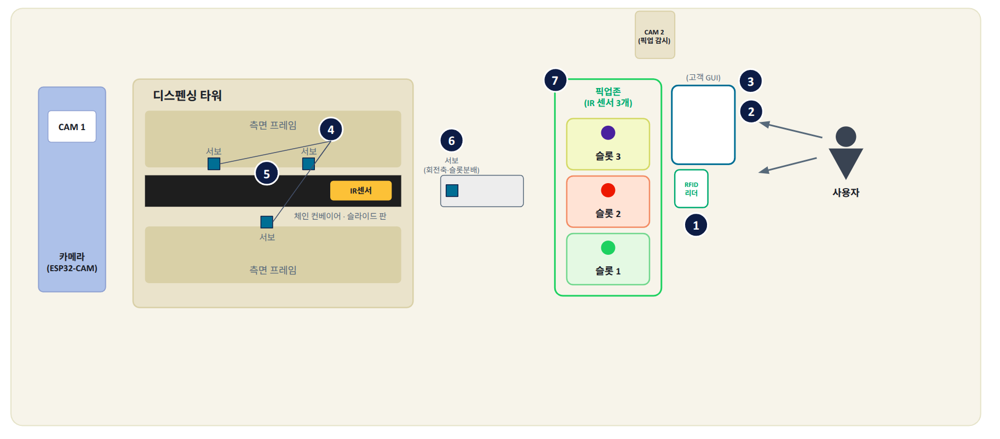
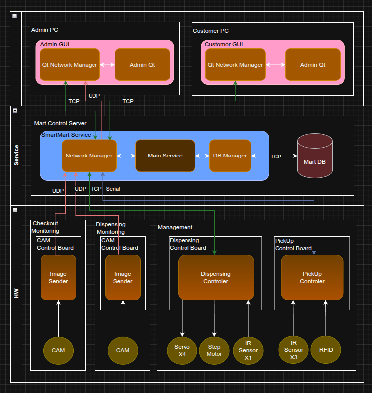
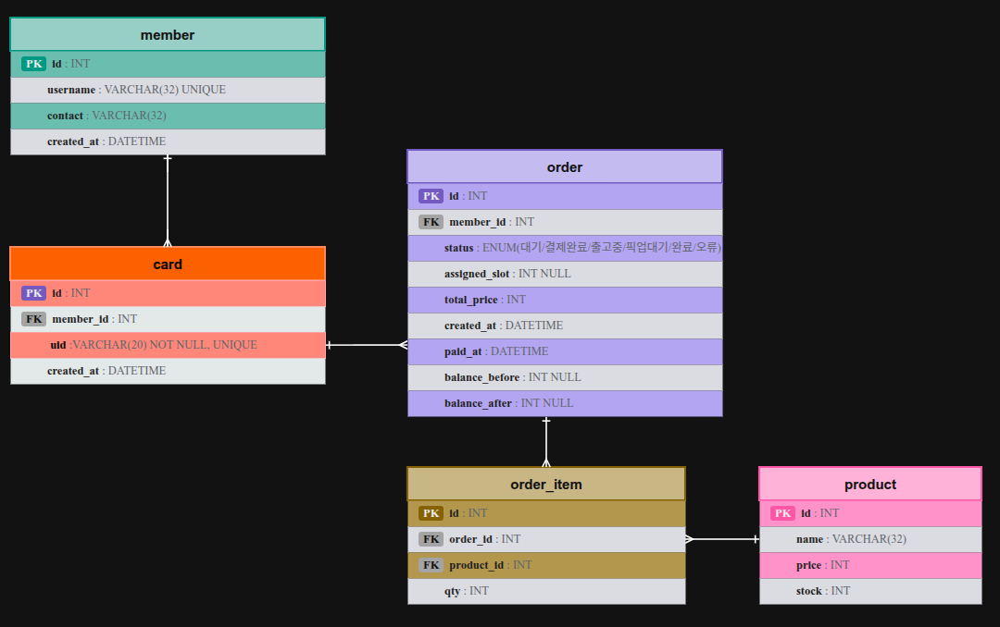
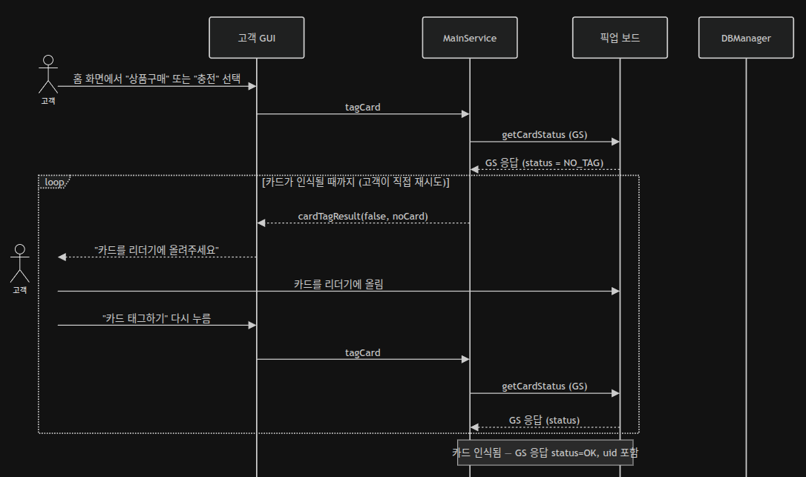
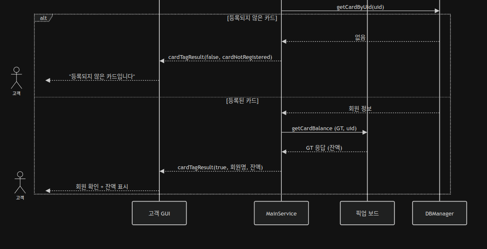
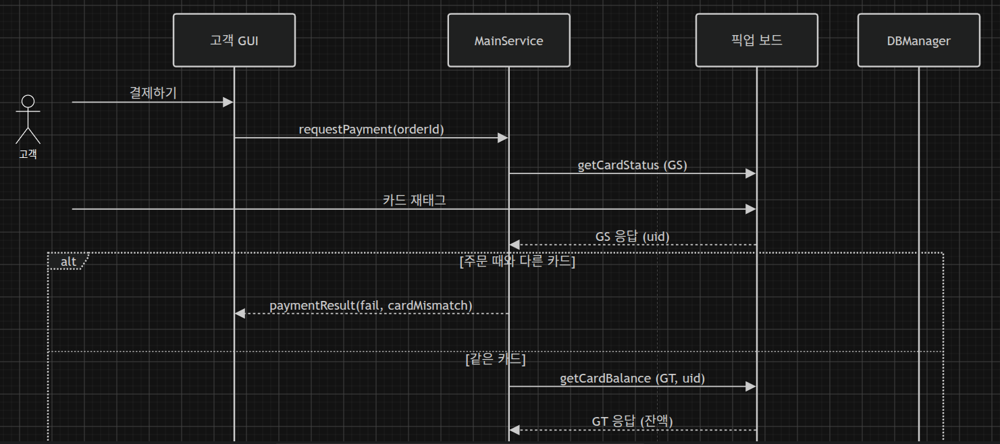
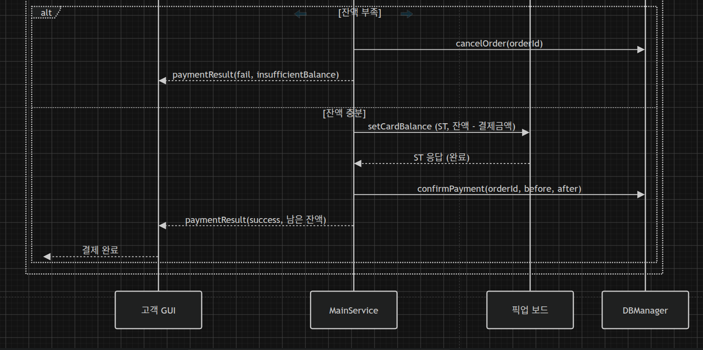
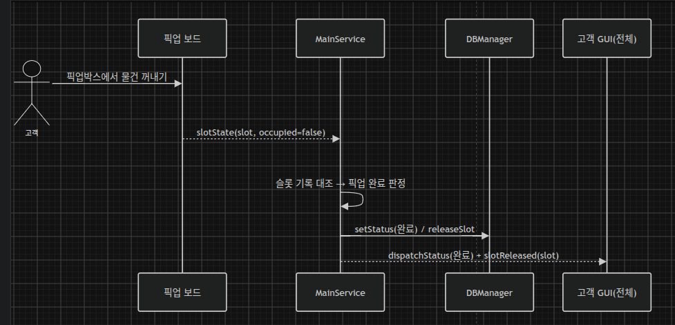
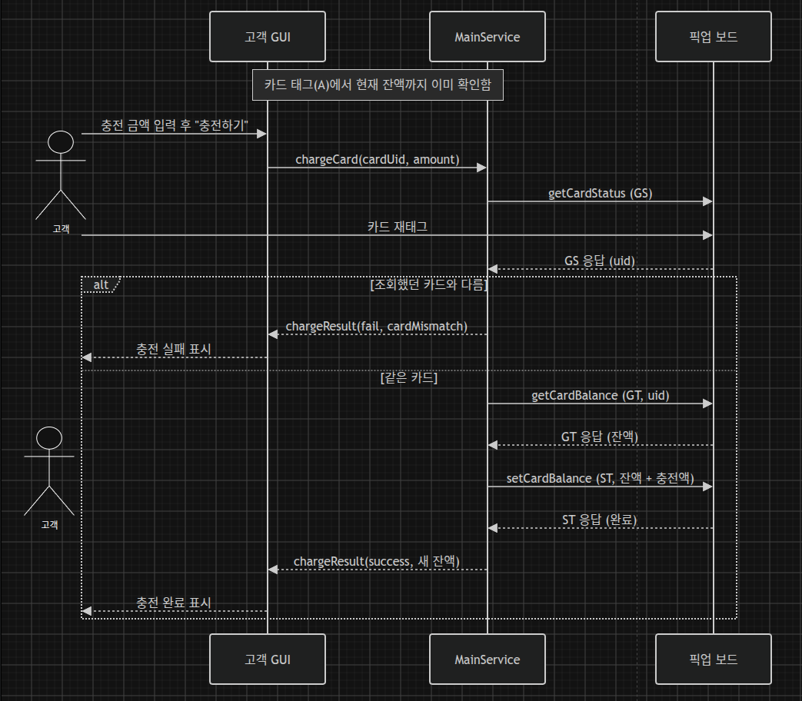

# iot-repo-2
IoT 프로젝트 2조 저장소. SmartMart
# SmartMart

무인매장 주문 · 결제 · 배송 자동화 시스템

<!-- 배너 이미지가 있으면 여기에 -->
<!--  -->

<!-- 발표자료 / 데모 영상 뱃지 (링크는 실제 업로드 위치로 교체) -->
<!--
[](여기에_발표자료_링크)
[](여기에_데모영상_링크)
-->

# 📚 목차

- [1. 프로젝트 개요](#1-프로젝트-개요)
- [2. 프로젝트 목적](#2-프로젝트-목적)
- [3. 기술 스택](#3-기술-스택)
- [4. 시스템 설계](#4-시스템-설계)
- [5. 주요 기능](#5-주요-기능)
- [6. 통신 프로토콜](#6-통신-프로토콜)
- [7. 시퀀스 다이어그램](#7-시퀀스-다이어그램)
- [8. 기술적 문제 및 해결](#8-기술적-문제-및-해결)
- [9. 구현 제약 및 확장 가능성](#9-구현-제약-및-확장-가능성)
- [10. 팀 구성](#10-팀-구성)

---

# 1. 프로젝트 개요

> ⏰ 프로젝트 기간: 2026.08.18 ~ 2026.08.28 (Physical AI Engineer 부트캠프 Project 1)

`SmartMart`는 고객이 키오스크(고객 GUI) 또는 모바일에서 상품을 주문·결제하면, 자동 출고 시스템이 해당 상품을 지정된 픽업존까지 이송해 전달하고, 관리자는 매장 전체를 CCTV·재고·회원 데이터로 통합 관제하는 **무인매장 자동화 시스템**입니다.

단순 자판기가 아니라, 여러 품목 동시 배송·회원(RFID 카드) 관리·관리자 도구·CCTV 관제까지 갖춘 무인매장 운영 시스템의 축소 모델을 목표로 합니다.

---

# 2. 프로젝트 목적

기존 무인매장 시스템은 다음과 같은 한계가 있습니다.

- 결제가 구매자 양심에 의존
- 직원 부재로 문제 발생 시 문의할 대상이 없음
- 상품 보관 공간까지 직접 찾아가 계산대까지 운반해야 함
- 재고·품절 여부를 실시간으로 알 수 없음

`SmartMart`는 고객이 상품 보관 공간에 직접 출입하지 않고, **결제 후 선택한 상품을 자동으로 분류·이송하여 전달**하도록 설계해, 상품 파손·도난·분실 위험을 줄이는 것을 목표로 합니다.

---

# 3. 기술 스택

| 분류 | 기술 구성 |
|---|---|
| **개발 환경** | Ubuntu Linux |
| **MCU/펌웨어** | ESP32(WROOM/CAM), Arduino IDE |
| **프로그래밍 언어** | Python, C++ |
| **DB** | MySQL |
| **버전 관리** | Git, GitHub |
| **협업 도구** | Confluence (SR/UR → Architecture → Scenario Design → Interface Spec → ERD 순으로 설계 문서 체계화) |

---

# 4. 시스템 설계

## 폴더 구조

```
iot-repo-2/
│
│
├── Service/                   # 서버 (Python)
│   └── MainService
│   │   └── mainService.py     # 판단 전담 — 주문 상태를 메모리로 관리
│   │
│   ├──Network       
│   │    ├── networkManager.py  # TCP · UDP · Serial 통신 전담
│   │    ├── serialModule.py
│   │    ├── TCPModule.py
│   │    └── UDPModule.py
│   │ 
│   └──DB
│       ├── dbManager.py       # MySQL 접근 전담 (기록·조회)
│       └── schema.sql
│
├── Hardware/                  # ESP32 / Arduino 펌웨어(cpp)
│   ├── dispensingBoard/       # 서보 4개 · 스텝모터 · IR센서(출고확인)
│   ├── pickupBoard/           # IR센서 3개 · RFID 리더
│   ├── pickupMonitoring/      # ESP32-CAM (계산대)
│   └── dispensingMonitoring/  # ESP32-CAM (출고구)
│
├── UI/                        # 관리자 · 고객 GUI
│   ├── qtNetworkManager/      # QT용 네트워크 매니저    
│   ├── adminGui/
│   └── customerGui/
│
├── assets/                    # README 첨부 이미지 · GIF
├── .gitignore
└── README.md
```


## 매장 배치도



카메라(계산대·픽업존) · 디스펜싱 타워(서보 4개 + 스텝모터 + IR센서) · 픽업존(고정 슬롯 3개 + RFID 리더)으로 구성됩니다.

## 시스템 아키텍처



| 계층 | 구성 |
|---|---|
| **UI** | 관리자 GUI · 고객 GUI |
| **Service** | MainService · NetworkManager · DBManager |
| **HW** | 자동 출고 장치 · 픽업대 · CAM(계산대/출고구) |

### 소프트웨어 구성 — 3개의 매니저

| 매니저 | 역할 |
|---|---|
| **NetworkManager** | TCP · UDP · Serial 통신 전담. GUI/보드/카메라와의 창구 |
| **MainService** | 주문 상태를 메모리로 관리하는 "판단" 전담 지휘자 |
| **DBManager** | MySQL 접근 전담. "기록·조회"만 담당 |

> 설계 원칙: **"판단은 메모리, DB는 기록·조회용"** — 실시간 로직은 MainService가 들고 있는 상태로 처리합니다.

### 하드웨어 구성

| 자동 출고 장치 | 픽업대 |
|---|---|
| 서보모터 3개 — 품목 배출 | RFID 리더 — 카드 인식 |
| 서보모터 1개 — 픽업슬롯 경로변경 | IR센서 3개 — 슬롯 점유 감지 |
| 스텝모터 — 컨베이어 구동 | |
| IR센서 — 출고 확인 | |

## ER 다이어그램



`member(1)—(N)card`, `member(1)—(N)order`, `order(1)—(N)order_item(N)—(1)product`

---

# 5. 주요 기능

## 💳 주문 · 결제


- 상품 목록 조회 및 수량 선택
- RFID 카드 태그를 통한 회원 인식 및 잔액 결제
- 카드 잔액 충전 기능

## 📤 상품 출고


- 주문 품목별 서보모터 순차 배출
- 스텝모터 기반 컨베이어 이송
- IR센서를 통한 출고 개수 확인

## 📍 픽업 슬롯


- 슬롯 경로변경 서보를 통한 지정 슬롯 배정
- IR센서 기반 픽업 슬롯 점유 상태 관리
- 슬롯 만석 시 신규 주문 대기 처리

## 📹 구역별 모니터링 (관리자)


- 계산대 · 출고구 CCTV 실시간 관제
- 전체 주문/재고/회원 현황 대시보드
- 통신 로그 실시간 확인

---

# 6. 통신 프로토콜

| 구간 | 방식 | 포트/속도 | 형식 |
|---|---|---|---|
| Qt(관리자·고객) ↔ 서버 | TCP | 9000 | UTF-8 JSON 1줄 + `\n` |
| 분배 보드(WiFi) ↔ 서버 | TCP | 9002 | 2글자 CMD + 바이너리 DATA |
| 픽업 보드(USB) ↔ 서버 | Serial | 115200 baud | 2글자 CMD + 바이너리 DATA |
| ESP32-CAM → 서버 | UDP | 6000(계산대) / 6001(출고구) | 8B 헤더 + JPEG 조각 |
| 서버 → 관리자 Qt (영상) | UDP | 클라이언트 임의 포트 | 위와 동일 포맷 |
| 서버 ↔ MySQL | TCP | 3306 | SQL |

분배·픽업 보드는 `LC`(로그인/카드) · `IM`(아이템 이동) · `GS`(UID 조회) · `GT`(잔액 조회) · `ST`(잔액 기록) · `SL`(슬롯 상태) 등 2글자 CMD 기반 바이너리 프로토콜을 사용합니다.

---

# 7. 시퀀스 다이어그램

각 시나리오를 주체(고객 GUI · MainService · 픽업 보드/분배 보드 · DBManager) 간 메시지 교환 순서로 표현했습니다.

### [A] 카드 태그



 

### [B] 주문 

 

### [C] 결제





### [D] 출고


### [E] 픽업 완료



### [F] 충전



---

# 8. 기술적 문제 및 해결

## CCTV UDP 영상이 갑자기 안 잡힘

**증상**: 정상 작동하던 ESP32-CAM의 UDP 영상 스트리밍이 어느 순간부터 서버에 도착하지 않음.

**확인 방법**: dmesg/시리얼 로그에서 재부팅 흔적 발견 — 서보·모터 여러 개가 동시에 전류를 크게 소모하는 순간 ESP32 전압이 순간적으로 강하했고, 노트북 USB 전원만으로는 감당하기에 전류가 부족했음.

**해결**: 모터/서보 전용 외부 5V 전원을 ESP32 로직 전원과 완전히 분리(GND만 공통 연결), 이후 디스펜싱 보드는 220V→5V 어댑터로 전원 안정성을 확보.

## 보드 통신 속도 개선 — JSON → 바이너리 프로토콜 전환

**배경**: 분배 보드·픽업 보드와의 통신을 처음에는 JSON(`{"cmd":"...", ...}` + 개행)으로 구현했으나, MCU(ESP32/Arduino)에서 매 메시지마다 JSON 파싱을 거치면서 처리 지연이 발생함.

**전환**: 보드 쪽 통신을 **2글자 CMD + 고정 길이 바이너리 DATA** 구조로 변경 (`GS`, `GT`, `ST`, `SL` 등).

**효과**:
- 패킷 크기가 대폭 줄어 전송 시간 감소
- MCU에서 JSON 파싱 과정 자체가 없어져 처리 속도 향상
- 문자열 파싱 대신 바이트 위치로 값을 바로 읽어 로직 단순화

**적용 범위**: Qt(관리자·고객) ↔ 서버 구간은 가독성·확장성을 위해 JSON을 유지하고, 실시간성이 중요한 **보드(분배·픽업) ↔ 서버 구간만 바이너리로 전환**하는 방식으로 구분 적용함.

---

# 9. 구현 제약 및 확장 가능성

## 하드웨어적 한계

| 제약 사항 | 현재 구현 방식 |
|---|---|
| 서보 토크 한계 | 무게가 있는 품목은 목표각도 근처에서 헌팅(떨림) 발생 — 가벼운 품목 위주로만 운용 가능 |
| 품목 수 제한 | 슬라이드 판 구조상 서보 1개당 품목 1종 — 현재 3개 품목(생수/과자/음료수)까지만 배출 |
| 고정된 픽업 슬롯 수 | 픽업존이 3개 슬롯으로 고정 — 동시 대기 가능한 주문 수가 그 이상 못 늘어남 |
| 단일 컨베이어 라인 | 배출 → 이송 경로가 하나뿐 — 여러 주문이 겹치면 순차 처리만 가능 |
| 수동 재고 보충 | 재고 소진 시 관리자가 직접 물리적으로 채워 넣어야 함 |

## 확장 가능성

- **모바일 앱 원격 주문**: 매장 도착 전 미리 주문 → 도착 즉시 픽업만 하면 되는 흐름으로 확장
- **로봇팔 도입**: 서보 슬라이드 방식 대신 로봇팔 피킹으로 전환 시, 품목의 형태·무게 제약 없이 다양한 상품 취급 가능
- **적재·재고 보충 자동화**: 로봇팔 + 창고 연동으로 재고 소진 시 사람 개입 없이 자동 보충
- **자율주행 배송 연동**: 픽업존에서 사람이 직접 수령하는 대신, 자율주행 로봇과 연동해 사무실·자택까지 배달하는 형태로 확장

---

# 10. 팀 구성

| 이름 | 담당 |
|---|---|
| 문상민 | 시스템 총괄 및 설계 · DB 설계 · 협업 관리 |
| 구본학 | 하드웨어 제작 및 보드 제어(디스펜싱/픽업 보드) |
| 이준엽 | 서비스 로직 구현(중앙제어 · 통신) |
| 이효석 | 하드웨어 제작 및 보드 제어(CAM보드) |
| 홍유수 | 관리자 및 사용자 GUI · 통신 연동 |
